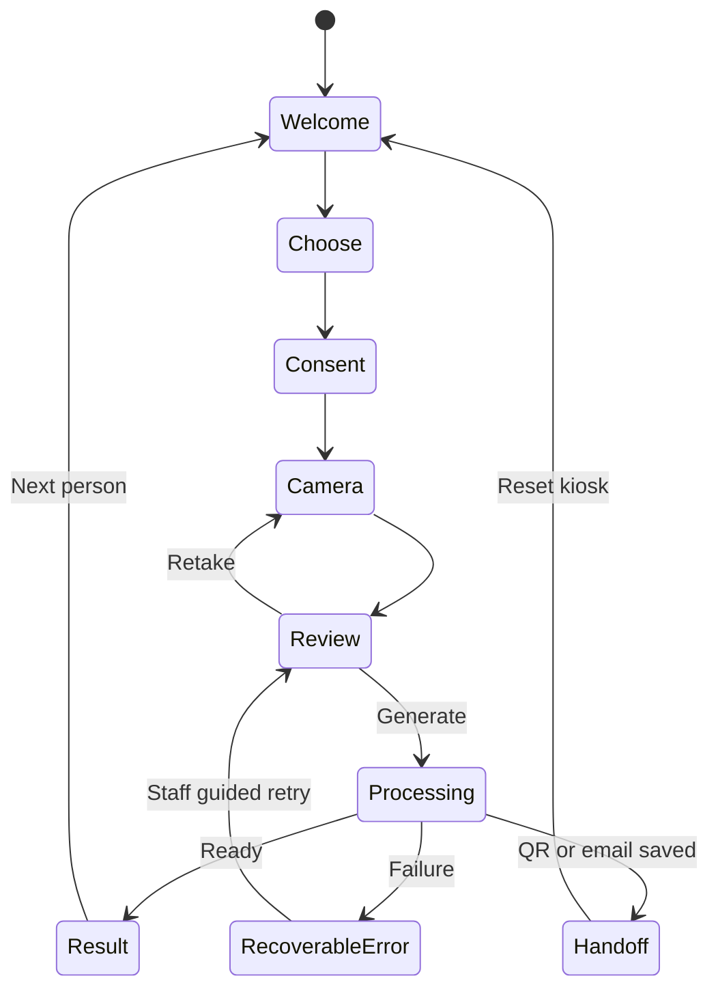

# KU Alter Ego — Design Specification

Project: Khalifa University AI Club photo booth  
Working name: KU Alter Ego  
Updated: 2026-09-17  
Companion file: [plan.md](./plan.md)

This specification defines the proposed interface, content, visual system, and image-theme behavior. Use approved university/club assets when supplied. The working name, colors, and copy are proposals, not official university brand standards.

## 1. Experience direction

Build a playful digital photo booth with a strong AI Club identity. The visitor should understand the interaction from a distance: choose a universe, take a photo, and collect an AI portrait.

Working title: **KU Alter Ego**  
Primary line: **Pick your universe.**  
Supporting line: **One photo. A different version of you.**  
Organization label: **Khalifa University · AI Club**

Use a dark stage, bright accent colors, expressive theme previews, and a satisfying reveal. Keep the visitor's face and the next action visually dominant.

### Design principles

- One main action per screen.
- Examples explain themes faster than long descriptions.
- The capture and result areas receive more space than decorative elements.
- Playful copy can surround clear operational status.
- Visitors can leave the kiosk while processing continues.
- Consent, email, and result access are easy to understand.
- Touch, keyboard, and reduced-motion use are supported.
- Private visitor content disappears when the session ends.

## 2. MVP screens and routes

| Screen | Proposed route/state | Main purpose |
| --- | --- | --- |
| Welcome | `/`, idle | Attract visitors and start a session |
| Theme selection | `/`, choose | Select one of three visual themes |
| Consent and camera | `/`, capture | Explain processing and frame the visitor |
| Capture review | `/`, review | Approve or retake the selfie |
| Processing and handoff | `/`, processing | Show status, QR, and optional email |
| Portrait reveal | `/`, result | Show the image and collection options |
| Mobile collection | `/p/[token]` | Pending/result/download/expired experience |
| Staff view | `/admin` | Queue, failures, event limits, and pause control |

The booth is one guided flow, not a conventional marketing site. The visitor does not need a navigation menu, account registration, or a dashboard.

## 3. Visual tokens

Use these as initial CSS custom properties. Validate final contrast in the actual components, including disabled and hover states.

| Token | Value | Usage |
| --- | --- | --- |
| `--bg` | `#09090F` | Main background |
| `--surface` | `#14141F` | Cards and panels |
| `--surface-raised` | `#1D1D2B` | Dialogs and selected containers |
| `--text` | `#F5F5FA` | Main text |
| `--text-muted` | `#B3B3C6` | Secondary copy |
| `--border` | `#343448` | Decorative separation |
| `--control-border` | `#77778F` | Input boundaries that need stronger contrast |
| `--primary` | `#C4B5FD` | Primary button background and selected emphasis |
| `--on-primary` | `#171126` | Primary button label |
| `--accent-cyan` | `#67E8F9` | Cyberpunk accent and focus highlight |
| `--accent-pink` | `#F9A8D4` | Secondary decorative accent |
| `--success` | `#86EFAC` | Completed status |
| `--warning` | `#FDE68A` | Delay or expiry notices |
| `--error` | `#FCA5A5` | Error labels |

Color should never be the only indicator of selection or status. Pair it with a label, icon, border treatment, or check mark.

### Typography

| Role | Proposed face | Desktop | Mobile |
| --- | --- | --- | --- |
| Hero | Space Grotesk, sans-serif | 56–72 px | 36–44 px |
| Screen title | Space Grotesk, sans-serif | 32–40 px | 28–32 px |
| Card title | Space Grotesk, sans-serif | 22–24 px | 20–22 px |
| Body and controls | Inter, sans-serif | 16–18 px | 16–18 px |
| Optional status label | IBM Plex Mono, monospace | 13–14 px | 13–14 px |

Use comfortable body line height around 1.5. Keep essential instructions at least 16 px. Self-host or reliably bundle fonts for the booth, with system fallbacks.

### Geometry and spacing

- Use an 8 px spacing rhythm, with 4 px for small internal adjustments.
- Main content width: approximately 1200 px.
- Desktop page padding: 32–48 px; mobile padding: 16–20 px.
- Card radius: 20–24 px; input/button radius: 12–16 px.
- Main booth buttons: at least 56 px tall; other touch targets: at least 44 × 44 px.
- Camera and portrait stage: square, without cropping the top of the visitor's head.
- Use restrained shadows and occasional accent glow. Keep labels crisp.
- Optional fine grain or a faint background grid should remain subtle and static by default.

## 4. Responsive composition

| Viewport | Layout |
| --- | --- |
| Wide booth display | Camera/portrait on one side, instructions and actions on the other |
| Tablet or narrow laptop | Centered stage with controls below; avoid a crowded side rail |
| Mobile result page | One column, portrait first, full-width download action |

At roughly 1024 px and above, use two columns where helpful. Below that, stack content. Choose breakpoints based on actual fit, not device labels.

On-screen keyboards must not hide email confirmation buttons. At 200% zoom, controls remain reachable and content does not overlap. Do not require horizontal scrolling.

## 5. Screen specifications

### A. Welcome

Show the organization label, working title, short supporting line, and a prominent **Create my alter ego** button. Use three example portraits to make the transformation obvious.

Examples must use licensed, synthetic, or explicitly consented imagery and be labeled as examples. Never show previous visitors' portraits as idle-screen content without their separate permission.

An optional quiet footer can show the event name once supplied. Do not display invented event dates, endorsements, or unapproved logos.

The camera is off on this screen.

### B. Theme selection

Show three equally sized cards: **Cyberpunk**, **Mysterious**, and **Doodle**. Each includes a consistent portrait crop, title, short description, and selected state.

| Theme | Card description | Visual accent |
| --- | --- | --- |
| Cyberpunk | Neon city. Future-you energy. | Cyan and pink |
| Mysterious | Moonlit fog. Cinematic presence. | Violet and cool blue |
| Doodle | Bold lines. Maximum personality. | Warm yellow with ink-like graphics |

Use one deliberate selection and a **Use this theme** action. Include a visible selected label/check. A card must be usable by keyboard and touch; hover is decorative only.

Preview the selected theme's accent in the surrounding stage. Keep base text, controls, and contrast consistent across themes.

### C. Consent and camera

Before upload or camera use, explain in plain language that the photo will be processed by an AI service and stored for the displayed collection period. Link to the full privacy notice.

Consent text must match the final providers, retention configuration, and club process. Include an unchecked affirmative choice to continue with the photo processing. Any future marketing or gallery consent is separate and optional.

Use **Open camera** as the action that requests browser permission. Request video only. Show a square framing guide, eye-line hint, and short instruction: **Face the camera and keep your face inside the frame.**

Allow camera selection where more than one camera is available. Keep the background free of other visitors. The preview can be mirrored for familiarity; make the saved-image orientation consistent and test any visible text/logos.

Main action: **Take photo**. Run a large, readable 3–2–1 countdown. Give a brief visual capture cue without a full-screen strobe. Sound is optional and off by default.

### D. Capture review

Display the captured image at the same size and crop used in the camera stage. Show the selected theme and two choices: **Retake** and **Generate my portrait**.

This is the last review before a paid generation request. Retaking at this stage does not submit a model request. Disable the generate button once submission begins and keep the same logical submission key through network retries.

If the person changes the theme here, preserve the approved selfie until they choose to retake or leave the session.

### E. Processing and handoff

The screen contains the chosen theme, a subtle animated stage, accurate status text, and collection controls. Do not reveal partially processed visitor images unless the implementation actually supports that behavior.

| Actual state | Primary status |
| --- | --- |
| Uploading | Uploading your photo… |
| Queued | Your portrait is in the queue. |
| Generating | Creating your portrait… |
| Processing | Adding the finishing touches… |
| Complete | Your alter ego is ready. |

Optional playful secondary messages include **Rendering your main character arc…** and **Adding unreasonable amounts of aura…**. These must not replace status information or imply a real processing percentage.

Show **Scan to collect on your phone** with a clear, high-contrast QR code. Encode only the visitor result URL. Keep the QR's quiet zone, avoid decorative logo overlays, and test scanning on the actual screen at normal booth distance.

If waiting time is shown, derive it from observed queue and generation performance and label it as an estimate. Otherwise show status without a countdown.

Include an optional **Email me my portrait** form. The visitor may save that request while the job is pending. Show **Next person** after a clear handoff confirmation, such as **I've opened the link**, or after confirming the saved email request. Explain that processing continues after the booth resets.

### F. Portrait reveal

Display the image prominently with a short reveal transition and the line **Your alter ego is ready.** Show the theme label and collection actions below.

On the kiosk, prioritize QR collection and email. On the visitor's phone, prioritize **Download photo**. Avoid routinely downloading visitor images into the shared booth computer's Downloads folder.

Include **Next person** as the kiosk's completion action. Generating a different theme is another paid job and must respect admission/budget limits; leave unlimited regeneration outside the MVP.

### G. Mobile collection

The result page uses the same brand identity in a simpler one-column layout. It must work without an account and reflect pending, completed, failed, deleted, or expired states.

Show the final portrait, a prominent download action, the exact expiry date, optional email delivery, and a visitor-authorized deletion control. Use the authorized management flow for destructive actions; a public job ID is never enough.

When the link expires, explain that the photo is no longer available. Do not keep serving a cached copy through an old result page. Hide staff controls and generation actions from this route.

### H. Staff view

Require staff authentication. Show a compact queue table with job state, waiting time, processing time, and safe error information. Provide event totals, reserved/recorded usage, a pause switch, and controlled recovery actions.

Avoid putting participant emails and face thumbnails on a large public-facing screen. Mask contact details unless staff need them for a specific support action.

The pause action stops new admissions while existing jobs and result access continue. Label any action that starts another paid generation.

## 6. Interaction state model



The diagram describes kiosk navigation. The durable generation job continues after the kiosk reaches Welcome through Handoff. Mobile access follows the job independently.

Persist only the minimum authorized session state needed for recovery. Never restore the previous visitor's selfie or email into a new session using shared browser history or saved form values.

## 7. Image prompt system

Store the following prompts on the server, versioned alongside their preview assets. The client submits a theme ID. Do not let the browser provide arbitrary prompt text, model names, or output counts.

### Shared base prompt

```text
Transform the supplied portrait into the visual style described below.
Keep the same person recognizable through their facial structure, skin tone,
expression, and distinctive visible features. Preserve glasses and head
coverings if present. Keep one person, a clear face, and a centered
head-and-shoulders composition. Preserve the coverage of the original clothing.
Apply the theme through illustration style, lighting, and environment.
Keep the eyes visible and avoid obscuring the face with effects.
Do not add text, logos, signatures, or watermarks.

THEME:
{theme_prompt}
```

### Cyberpunk — `cyberpunk`, prompt version `1`

```text
Create a cinematic portrait in a futuristic neon city at night.
Use cyan and magenta rim lighting, rain reflections, distant holographic
shapes, and a richly detailed urban background. Keep the face unobstructed
and recognizable. Add subtle futuristic styling to the environment and
accessories while preserving the subject's pose and clothing coverage.
```

### Mysterious — `mysterious`, prompt version `1`

```text
Create an atmospheric cinematic portrait surrounded by moonlit fog.
Use deep indigo and muted violet tones, a softly illuminated ancient
doorway in the background, and subtle floating light particles.
Keep the face clearly visible with gentle directional light.
The mood is intriguing and elegant, with natural facial proportions.
```

### Doodle — `doodle`, prompt version `1`

```text
Turn the portrait into a recognizable hand-drawn illustration.
Use bold ink outlines, expressive but faithful facial features, playful
colorful scribbles, stars, arrows, and a light sketchbook background.
Keep the face as the main focus. Arrange decorative doodles around the
person without covering the eyes or replacing distinctive features.
```

### Optional later themes

| ID | Prompt direction |
| --- | --- |
| `cosmic` | Recognizable space-explorer portrait with a nebula, orbital structures, cosmic lighting, and an unobstructed face |
| `retro-arcade` | Recognizable arcade character portrait with bold pixel-inspired shapes, saturated colors, and an energetic game-world background |

Treat every prompt as a starting point. Review representative test portraits for identity, skin tone, glasses, head coverings, pose, artifacts, and visual consistency. Reject theme/settings combinations that repeatedly change the person too much. Identity preservation is an evaluation goal, not a guarantee.

OpenAI supports editing an existing image with a prompt and configurable output settings; confirm exact model parameters when integrating. [Image generation documentation](https://developers.openai.com/api/docs/guides/image-generation)

## 8. Generated image composition

Create the artwork first, then add branding in code using the approved assets. Do not ask the image model to reproduce the university logo or event text.

Default composition:

- Artwork: 1024 × 1024 px JPEG.
- Footer: append an approximately 96 px high strip beneath the artwork, producing a 1024 × 1120 px deliverable.
- Footer content: approved AI Club mark/name, theme label, and optional confirmed event name.
- Maintain internal padding and preserve the full face/artwork area.
- Never include the participant's email, result token, or QR access secret in the downloadable image.
- Use a predictable safe filename, such as `ku-alter-ego-cyberpunk.jpg`.

The reveal preview must match the downloadable branded file. Compress enough for mobile collection while retaining good portrait detail. Generate alternate layouts only if they are explicitly added to scope.

## 9. Email interaction and content

Field label: **Email address (optional)**  
Helper text: **We'll send a link to this portrait.**  
Initial action: **Continue**  
Confirmation: **Send your portrait link to [address]?**  
Final action: **Send my portrait**

Permit edits before confirmation. Do not silently correct the domain or assume syntax validation proves the address belongs to the visitor.

For a pending job, show **Email request saved. We'll send it when your portrait is ready.** After provider acceptance, show **Your email is on its way. You can also scan the QR code.** A bounce should offer address correction or QR collection.

Email template structure:

1. Sender name: Khalifa University AI Club, using the verified approved sending domain.
2. Subject: **Your AI Club alter ego is ready**.
3. Short introduction with the selected theme.
4. Primary button: **View and download your portrait**.
5. Expiry date and a note that the link grants access to the image.
6. Club identity and support contact once provided.

Keep delivery email separate from marketing. Use a result link as the MVP; do not depend on remote images being displayed in the email client.

## 10. Component inventory

| Component | Required behavior |
| --- | --- |
| `BoothShell` | Stage layout, organization label, controlled navigation |
| `ThemeCard` | Example, label, selection state, keyboard/touch support |
| `ConsentPanel` | Clear processing notice and affirmative choice |
| `CameraStage` | Preview, framing guide, permission/error states |
| `Countdown` | Readable 3–2–1 with reduced-motion behavior |
| `CaptureReview` | Stable image crop, retake, generate |
| `GenerationStatus` | Actual status, optional measured wait, accessible announcement |
| `CollectionQR` | High-contrast QR, quiet zone, collection instructions |
| `EmailDeliveryForm` | Validation, explicit confirmation, delivery-request states |
| `PortraitResult` | Generated image, collection actions, expiry |
| `ResetWarning` | Inactivity warning, Continue session, timeout action |
| `ErrorState` | Plain-language message and a valid recovery action |
| `StaffQueue` | Protected queue status and event controls |

## 11. Motion and accessibility

- Button/card transitions: approximately 150–200 ms.
- Screen transitions: approximately 200–300 ms with small movement.
- Reveal: approximately 350–450 ms, using a restrained scale/opacity transition.
- Under `prefers-reduced-motion`, remove looping decoration, large movement, and reveal scaling.
- Provide visible keyboard focus and meaningful names for all controls.
- Use semantic buttons, form labels, and an accessible radio-group pattern for themes.
- Announce meaningful job-state changes through a polite live region; avoid repeatedly announcing decorative loading copy.
- Return focus to a logical control after dialogs, errors, and screen changes.
- Maintain at least 4.5:1 contrast for normal text and 3:1 where applicable for large text and essential UI boundaries.
- Make sound optional. Do not rely on hover, color, animation, or QR scanning as the only route to the next step.
- Offer staff assistance and email collection for visitors who cannot scan a QR code.

## 12. Failure and empty states

| Situation | Visitor message | Action |
| --- | --- | --- |
| Permission denied | Camera access is off. Allow access in your browser to take a photo. | Try again / Ask a volunteer |
| Camera unavailable | We couldn't open the camera. | Choose camera / Ask a volunteer |
| Poor framing | Move a little closer and keep your face inside the frame. | Retake |
| Upload failed | Your photo couldn't upload. Please try again. | Retry the same upload |
| Longer queue | We're busy creating portraits. You can collect yours on your phone. | Scan QR / Save email request |
| Generation failed | We couldn't create this portrait. A volunteer can help you try again. | Staff-guided retry |
| Request rejected | This photo couldn't be processed. Please take another photo or ask a volunteer. | Retake / Help |
| Email failed | The email couldn't be sent. Your portrait is still available here. | Edit address / QR collection |
| Event paused | The booth is taking a short break. Please check with a volunteer. | Return to welcome |
| Link expired | This portrait is no longer available. | Show support details if available |
| Photo deleted | Your portrait has been removed from this experience. | End state |

Do not show stack traces, API keys, provider request bodies, or internal billing errors to visitors. Never replace a failed personal result with an unrelated sample image.

## 13. Kiosk reset and privacy behavior

Proposed timeout: after 90 seconds of inactivity, show a 15-second warning with **Keep my session open**. Disable inappropriate timeout behavior during active camera permission dialogs where the visitor is still interacting. Tune the timing in the rehearsal.

On reset:

1. Stop camera tracks and revoke local object URLs.
2. Clear the photo, email, QR code, selection, and visitor management state from memory and browser storage.
3. Remove the visitor's kiosk access and prevent Back from restoring their private screen.
4. Keep accepted background jobs and valid mobile/email handoff working.
5. Return to the Welcome screen with the camera off.

Warn before resetting an uncollected result. Allow staff to help a visitor preserve their collection link. Never make previous-session content available from a public history/gallery view.

## 14. Assets and implementation handoff

Required assets:

- Approved club/university mark, ideally an SVG or transparent PNG.
- Three representative theme previews with permission for public display.
- Optional confirmed event name and support contact.
- Font files or bundled font configuration.
- Small SVG/CSS decorative accents; avoid heavy background video for the MVP.

Store theme previews locally so the welcome and selection screens do not depend on third-party image URLs. Keep the preview framing consistent. Clearly label placeholder assets during development and replace them before the event.

### Design acceptance checklist

- [ ] A new visitor understands the main interaction from the welcome screen.
- [ ] Theme selection is obvious without reading a paragraph.
- [ ] Camera instructions, buttons, and errors are readable at booth distance.
- [ ] Capture review uses the same crop/orientation as the submitted image.
- [ ] Processing shows real states and offers QR/email handoff.
- [ ] A phone can scan the QR from the actual booth display.
- [ ] The reveal matches the file that is downloaded.
- [ ] Email is optional and confirmed before sending.
- [ ] Mobile layouts remain usable with the keyboard open and at 200% zoom.
- [ ] Keyboard, focus, contrast, and reduced-motion behavior work throughout.
- [ ] Reset leaves no previous visitor content accessible on the kiosk.
- [ ] Approved branding and final privacy/expiry copy replace all placeholders.

First design slice: implement Welcome, the Cyberpunk card, Camera, Review, Processing, and the mobile Result page using the shared tokens. Validate the full interaction before adding elaborate decoration or more themes.
