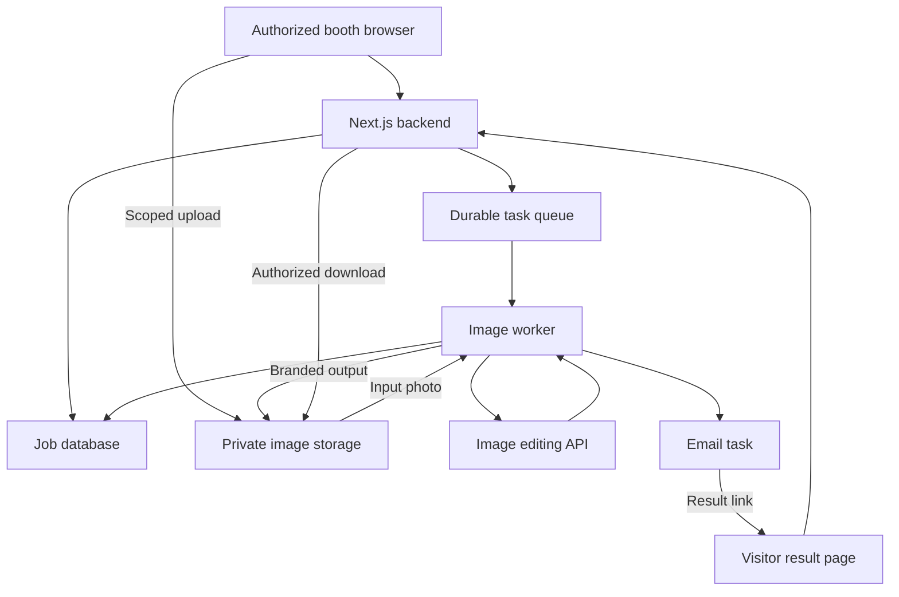

# KU Alter Ego — Implementation Plan

Project: Khalifa University AI Club photo booth  
Working name: KU Alter Ego  
Updated: 2026-09-17  
Companion file: [design.md](./design.md)

This document defines a proposed implementation. The website, integrations, credentials, approved branding, and event details still need to be supplied or built. Defaults below should be validated in a small pilot before the event.

## 1. Product goal

Build an interactive browser-based AI photo booth for the AI Club's university event. A visitor chooses a visual theme, captures a selfie, and receives a recognizable stylized portrait. They collect the image using a QR code, a mobile download, or optional email delivery.

The camera preview is live. AI generation begins after a still photo is captured and approved. Processing must continue independently of the booth browser so the next visitor can use the station.

The experience should feel playful, visually distinctive, and easy to use without an explanation from a developer.

### Planning assumptions

| Item | Proposed starting point |
| --- | --- |
| Event size | Approximately 300 visitors over four hours; confirm actual attendance |
| Capture stations | Two laptops or tablets with cameras |
| Team | One or two developers and event volunteers |
| MVP themes | Cyberpunk, Mysterious, Doodle |
| Generation | One image per confirmed capture |
| Output | 1024 × 1024 JPEG plus a consistent club footer |
| Visitor account | No registration; temporary, scoped access |
| Collection | Private QR result page and optional email |
| App retention | Originals removed after the retry window; results available for seven days |

## 2. Scope

### Required for the booth

- Welcome screen with examples and a prominent start action.
- Three theme cards backed by versioned server-side prompts.
- Consent notice, camera permission handling, countdown, preview, and retake.
- Private photo upload and asynchronous image editing.
- Persistent job status and a result page that works on a phone.
- QR handoff while the photo is processing.
- Optional email delivery with address confirmation and resend limits.
- Branded final image, added using image composition after generation.
- Staff authentication, booth authorization, queue monitoring, and pause control.
- Submission limits, duplicate prevention, retry policy, and a spending guard.
- Session reset, deletion, expiry, and scheduled cleanup.

### Later improvements

- Additional themes: Cosmic Explorer and Retro Arcade.
- Arabic interface and right-to-left layout.
- Before/after comparison, separately exported portrait layouts, or printing.
- Public gallery with separate explicit consent.
- Visitor-operated mobile capture after abuse controls are validated.

Keep the first release focused on single-person portraits and predefined themes. Free-text prompting, group portraits, accounts, payments, and live video transformation are outside the MVP.

## 3. Visitor journey

1. **Welcome:** Start a fresh visitor session on an authorized booth device.
2. **Choose:** Select a theme using an example portrait and a short description.
3. **Consent:** Explain image processing, providers, retention, and optional delivery.
4. **Capture:** Open the camera, show framing guidance, and run a three-second countdown.
5. **Confirm:** Let the visitor retake the photo or approve it for generation.
6. **Process:** Upload the image and create one durable job. Show actual job status.
7. **Hand off:** Show a QR result link immediately; optionally collect an email request.
8. **Reveal:** Display the completed image on the kiosk or the visitor's result page.
9. **Collect:** Download on the phone or receive a result link by email.
10. **Reset:** Clear the kiosk's visitor data while the durable job continues if necessary.

The QR code must work before generation finishes. A visitor who confirms they have opened the link, or who has saved an email request, can leave the kiosk without losing access to the result.

## 4. Technology choices

| Layer | Proposed tool | Responsibility |
| --- | --- | --- |
| Web application | Next.js and TypeScript | Screens, server routes, authorization |
| UI | Tailwind CSS and Motion | Design tokens, layout, transitions |
| Camera | Browser `getUserMedia()` and canvas | Live preview and still capture |
| Hosting | Vercel | Website deployment and HTTPS |
| Database | Supabase Postgres | Sessions, jobs, attempts, delivery records |
| File storage | Supabase private buckets | Temporary inputs and completed outputs |
| Background tasks | Trigger.dev | Durable tasks, queues, bounded retries, cleanup |
| AI service | OpenAI Image API, image-editing endpoint | Selfie transformation |
| Image composition | Sharp | Normalize images and apply approved footer/logo |
| Email | Resend | Transactional result delivery |
| QR codes | A maintained QR library | Encode the visitor's result URL |

Use stable package versions compatible with the chosen Next.js release, commit the lockfile, and verify provider quotas before the event. Keep provider integrations behind small server-only modules so they can be changed without rewriting the UI.

Start the image-quality pilot with `gpt-image-2.5-sunburst`, subject to account access. Compare `gpt-image-2.5-flare` if speed is a constraint. Keep the selected model in `OPENAI_IMAGE_MODEL`; record it with each generation attempt. Check current availability, supported parameters, limits, and pricing before implementation. [OpenAI image guide](https://developers.openai.com/api/docs/guides/image-generation)

## 5. System architecture



The backend stores a job and schedules durable work before reporting successful submission. Do not start a detached promise in a request handler and assume it will survive after the response.

Use an outbox record written with the job in one database transaction, then dispatch it with a unique job key. A reconciliation task should recover jobs whose initial task dispatch failed. This prevents a queued job from silently disappearing between the database write and task submission.

### Processing sequence

1. Create a visitor session associated with an authorized kiosk.
2. Issue a short-lived upload URL scoped to that session and one object path.
3. Capture and compress a JPEG, then upload directly to private storage.
4. Validate the stored file server-side, including decoded type, dimensions, size, and ownership.
5. Create the job, reserve its budget allowance, and persist its dispatch record atomically.
6. Resolve the approved theme prompt on the server; never trust client-supplied prompt text.
7. The worker loads the photo and calls the image-editing API with one image output requested.
8. Persist the raw output immediately, compose the branded deliverable, then mark the job complete.
9. The kiosk and mobile result page read the job state through authorized endpoints.
10. Schedule delivery if an email request exists. A separate email task sends the existing result.
11. Delete the original after the supported retry window and expire remaining assets on schedule.

Only send the photo and theme prompt to the image provider. The visitor's email is unnecessary for generation.

## 6. Suggested repository structure

| Path | Purpose |
| --- | --- |
| `app/page.tsx` | Booth experience |
| `app/p/[token]/page.tsx` | Mobile pending/result/expired page |
| `app/admin/page.tsx` | Staff controls |
| `app/api/` | Validated server endpoints |
| `components/booth/` | Theme picker, camera, preview, processing, result |
| `components/ui/` | Buttons, fields, dialogs, status indicators |
| `lib/server/themes.ts` | Versioned theme prompts and allowed settings |
| `lib/server/images.ts` | Image provider adapter |
| `lib/server/storage.ts` | Private upload/download helpers |
| `lib/server/email.ts` | Delivery adapter and template |
| `lib/server/auth.ts` | Kiosk, visitor, result-token, and admin authorization |
| `lib/server/limits.ts` | Submission limits and budget reservations |
| `trigger/` | Generation, email, dispatch recovery, and cleanup tasks |
| `supabase/migrations/` | Schema and access-control policies |
| `public/brand/` | Approved club assets |
| `public/themes/` | Consented or licensed preview images |

Mark server modules accordingly. Import no provider secrets into client components.

## 7. Data model

| Entity | Essential fields |
| --- | --- |
| `kiosks` | ID, event ID, authorization state, enabled flag |
| `visitor_sessions` | ID, kiosk ID, consent version/time, access expiry, reset time |
| `photo_jobs` | ID, session ID, theme ID/version, status, input/output object paths, creation/completion/expiry times, unique submission key |
| `generation_attempts` | ID, job ID, attempt number, model, settings, provider request ID, status, timestamps, usage, estimated/billed cost, sanitized error |
| `result_access` | Job ID, hashed random token, permitted actions, expiry, revocation time |
| `email_deliveries` | ID, job ID, recipient, request version, status, idempotency key, provider message ID, attempt count |
| `task_outbox` | ID, job/delivery ID, task type, unique dispatch key, dispatch state, timestamps |
| `event_controls` | Event ID, pause state, generation limit, spend allowance, reserved/recorded usage |

Keep image bytes in object storage. The database stores object paths, not base64 images or long-lived public URLs.

Scope every visitor query to the session or validated result token. Row-level security and server authorization must prevent enumeration of other visitors' records. Privileged service credentials remain server-only.

### Job states

`queued → generating → processing → completed`

Failure paths end in `failed`; expired result access is represented by `expired` or a computed expiry. An uncertain provider timeout must be recorded explicitly on the attempt rather than treated as a known failure with unlimited retries.

Keep email states separate: `requested`, `sending`, `accepted`, `delivered`, `bounced`, and `failed`. Provider acceptance is not proof of inbox delivery.

## 8. API contract

Paths below are proposed application routes, not provider API endpoints.

| Method and path | Input | Response and requirement |
| --- | --- | --- |
| `POST /api/sessions` | Consent version and acceptance | New visitor session; authorized kiosk required |
| `POST /api/uploads` | Session-bound capture metadata | Scoped upload URL and object reference |
| `POST /api/jobs` | Object reference, theme ID, submission key | `202`, job ID, current state, result URL; repeat submissions return the same job |
| `GET /api/jobs/:id` | Visitor/session authorization | Status, safe error, optional wait estimate; never disclose another session's job |
| `GET /api/results/:token` | Opaque result token | Pending/completed/expired state and authorized output access |
| `POST /api/jobs/:id/email` | Confirmed email and authorized delivery request | Delivery-request status; valid before or after generation |
| `DELETE /api/results/:token` | Valid management authorization | Revoke access and schedule asset/contact deletion |
| `POST /api/sessions/:id/reset` | Active kiosk session | End visitor access on the kiosk without canceling accepted work |
| `POST /api/admin/pause` | Staff credentials and pause state | Updated admission control |

Validate inputs with a shared schema library. Do not accept arbitrary image URLs or storage paths from the browser. Separate viewer access from destructive management access, or explicitly scope the result token to the permitted visitor actions. Protect state-changing routes against cross-site requests.

## 9. Reliability and cost controls

- Use a unique submission key and a database uniqueness constraint to handle double clicks and network retries.
- Give generation and delivery tasks independent identifiers and retry policies.
- Save successful image output before downstream composition or email work. A failed footer or email operation must reuse the saved output.
- Retry known transient failures with backoff and a small attempt cap. Do not automatically retry invalid input, account quota exhaustion, or rejected content.
- Record provider request IDs. A timed-out request may have been processed and billed; application idempotency alone cannot guarantee exactly-once execution at an external provider.
- Coordinate SDK retries with worker retries so attempts do not multiply unexpectedly.
- Limit both simultaneous work and requests/tokens per minute according to the account's actual limits.
- Reserve a conservative cost allowance before admitting work. Include in-flight jobs and retries in budget decisions; usage alerts alone are not a hard spending stop.
- Pause new work when the queue, spend allowance, or account limits are reached. Preserve access to already-created results.
- Reconcile stuck jobs and unprocessed outbox records. Show staff an actionable error without exposing provider details to visitors.
- Rate-limit per authorized kiosk, visitor session, job, and email destination. Campus visitors may share one public IP.

## 10. Camera, privacy, and handoff

Production camera access needs HTTPS and permission. Request video only, use a frontal framing guide, handle denied/missing/busy cameras, and stop media tracks when leaving the camera flow. [MDN camera documentation](https://developer.mozilla.org/en-US/docs/Web/API/MediaDevices/getUserMedia)

Generate result tokens using a cryptographically secure random generator with at least 128 bits of entropy. Store a hash for validation. A result link is a bearer secret: possession grants its specified access. Prevent token leakage in logs, referrers, analytics, and public pages; return private, non-cacheable result responses and disable indexing.

| Data | Proposed application retention |
| --- | --- |
| Unused uploads | Delete within 24 hours |
| Original photo for an accepted job | Delete after completion/retry window; maximum 24 hours unless the visitor explicitly requests otherwise |
| Generated raw and branded images | Delete after seven days or visitor deletion |
| Email delivery details | Delete after seven days; retain only necessary non-identifying operational totals |
| Result access | Revoke on deletion or expiry |
| Kiosk visitor state | Clear on Next person or inactivity reset |

Deletion must cover raw outputs, final images, temporary files, delivery records, and access tokens. Cancel or tombstone pending work so a late-running task cannot recreate a deleted result. Explain that already-delivered emails, downloaded copies, backups, and provider records have separate retention behavior.

Consent must describe third-party processing. App cleanup does not delete all provider records immediately. OpenAI documents default abuse-monitoring retention of up to 30 days, with exceptions. Confirm actual account settings and provider terms before publishing the notice. [OpenAI data controls](https://developers.openai.com/api/docs/guides/your-data)

Photo delivery, club marketing signup, and public-gallery consent are separate choices. Marketing and gallery publishing are outside the first release.

## 11. Email delivery

Use a verified club-controlled domain or a university subdomain configured by university IT. Complete sender setup early and test delivery to university email, Gmail, and Outlook. [Resend verified domains](https://resend.com/docs/dashboard/domains/introduction)

Send a branded message with the portrait's result link, expiry, and download instructions. A link is the MVP delivery format; attachments can be added later if required.

The email-request route and completion worker must converge on one unique pending delivery record so requests made near completion do not get lost or sent twice. Use a stable provider idempotency key within its supported window, plus persistent database delivery state and resend limits. [Resend idempotency](https://resend.com/docs/dashboard/emails/idempotency-keys)

Validate webhook signatures and deduplicate webhook events. Update accepted/delivered/bounced states without triggering image regeneration. Avoid logging complete email addresses or result tokens.

## 12. Configuration and deployment

Server-only configuration includes:

```text
OPENAI_API_KEY
OPENAI_IMAGE_MODEL
SUPABASE_URL
SUPABASE_SERVICE_ROLE_KEY
TRIGGER_SECRET_KEY
RESEND_API_KEY
RESEND_WEBHOOK_SECRET
EMAIL_FROM
APP_BASE_URL
```

Keep event limits, retention settings, theme versions, and pause state in validated server configuration or the database. Store secrets in the hosting/task provider's secret manager. Never prefix privileged keys with `NEXT_PUBLIC_` or commit them to source control.

Deployment order:

1. Create provider accounts, confirm image-model access, and configure the sending domain.
2. Create the database, migrations, private buckets, and access policies.
3. Deploy worker tasks and cleanup/reconciliation schedules.
4. Deploy the web application and configure its HTTPS domain and environment variables.
5. Configure verified email webhooks and staff authentication.
6. Enable the event controls and authorize the booth devices.
7. Run an end-to-end rehearsal on the actual university network.

Use separate development and production credentials where practical. Keep direct storage uploads and short backend requests; check the hosting plan's payload and function-duration limits. [Vercel function limits](https://vercel.com/docs/functions/limitations)

## 13. Milestones and acceptance checks

Estimated effort: 8–12 working days for a small team already comfortable with React and APIs. Allow extra time for learning, account verification, domain setup, and event approvals.

| Stage | Build | Acceptance check |
| --- | --- | --- |
| Days 1–2 | Model and prompt pilot | 30–50 representative edits reviewed; latency, quality, and billed cost recorded |
| Days 3–4 | Welcome, themes, camera, preview | Actual booth device completes capture and retake reliably |
| Days 5–6 | Private upload, job persistence, worker | Refresh and browser closure do not lose accepted jobs |
| Days 7–8 | QR page, email, branding | Phone retrieves pending/completed result; email delivery works |
| Days 9–10 | Auth, limits, cleanup, recovery, admin | Duplicate requests and failure paths are handled; access isolation verified |
| Days 11–12 | Booth rehearsal and polish | Volunteers run the flow without developer intervention |

### Launch checklist

- [ ] Each of the three themes produces recognizable results across varied visitors.
- [ ] Camera works on intended devices; denied permission and disconnected-camera states are usable.
- [ ] Duplicate Generate clicks create one logical job.
- [ ] QR link survives kiosk reset and displays the correct result.
- [ ] Closing or refreshing a browser does not cancel accepted work.
- [ ] Visitors cannot retrieve, email, or delete another visitor's job by guessing an ID.
- [ ] A send failure retries delivery without repeating image generation.
- [ ] An email request made during completion is neither lost nor duplicated.
- [ ] Pause and spend admission checks include work already in flight.
- [ ] Deletion during processing cannot recreate a public result later.
- [ ] Expired links stop granting access and scheduled deletion actually removes assets.
- [ ] Next person clears the photo, email, QR code, and visitor authorization from the kiosk.
- [ ] Touch, keyboard, readable contrast, and reduced-motion behavior are checked.
- [ ] The actual event network, backup connection, cameras, lighting, and power are tested.

Use simulated provider responses for most state, failure, and load checks. Run a smaller real-provider rehearsal to measure quality, account limits, and end-to-end latency.

## 14. Capacity and budget

For 300 visitors in four hours, arrival demand averages 75 visitors/hour. A 45-second capture-and-handoff cycle gives one station a theoretical ceiling of 80/hour. Two stations provide room for retakes and questions.

Approximate generation capacity before other limits:

`concurrent jobs × 3600 ÷ average generation seconds`

At 60 seconds per generation and two simultaneous jobs, the theoretical worker capacity is 120/hour. Actual capacity depends on account quotas, input/output size, retries, and traffic bursts. QR handoff reduces kiosk occupancy but does not increase model throughput.

Budget formula:

`visitors × average generation attempts per visitor × measured cost per attempt`

For 300 visitors and 1.2 attempts each:

| Illustrative average cost per attempt | Total for 360 attempts |
| --- | ---: |
| $0.05 | $18 |
| $0.10 | $36 |
| $0.25 | $90 |

These are scenarios, not provider quotes. Use actual pilot usage and current token rates to estimate input, prompt, output, and retry costs. Add testing, hosting, storage, task execution, email, domain, and hardware separately. An initial software/cloud allowance of US$100–200 is a planning reserve to revise after the pilot. [OpenAI model pricing](https://developers.openai.com/api/docs/models/gpt-image-2.5-sunburst)

## 15. Event operations and first task

Bring two capture devices if available, stable mounts, consistent frontal lighting, power extensions, and backup internet. Provide a clear capture position and keep the background uncluttered.

Assign one volunteer to visitor assistance and one to queue monitoring during peaks. If generation becomes unavailable, pause admission and explain the situation; do not imply that a demonstration image is the visitor's result.

First implementation task: make one complete Cyberpunk journey work on the intended booth hardware — capture, transform, and retrieve through a private QR result page. Then add the other themes, email, and visual polish.
